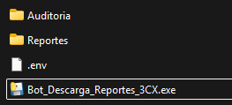
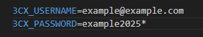
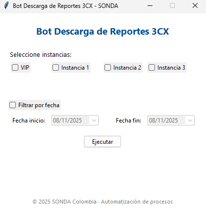

# Manual de Usuario - Bot Instancias 3CX-RPASonda

## 1. Introducción
Este sistema permite automatizar la descarga y unificación de reportes de la plataforma 3CX.

La herramienta se entrega como un archivo ejecutable (.exe) para su uso sin necesidad de abrir código.

## 2. Requisitos Previos
El programa se entrega como .exe, sin embargo requiere instalar previamente ciertos componentes para su correcto funcionamiento, especialmente porque usa **Playwright** para la automatización de navegación web.

### 2.1 Python y Playwright
 1. Instalar Python:
    - [Python 3.13.14](https://www.python.org/downloads/release/python-3134/)
    - Durante la instalación, asegúrese de seleccionar la opción **"Add Python to PATH"**.
 2. Instalar Playwright y Chromium (solo la primera vez):
    - Ejecute el siguiente comando en la consola de Windows:
        ```
        pip install playwright
        playwright install chromium
        ```
    Esto descargará el navegador Chromium usado para la herramienta.

## 3. Archivos entregados
Se entrega un archivo .zip con el siguiente contenido:
- **Bot_Descarga_Reportes_3CX.exe** → Programa principal
- Carpeta **Reportes/** → Directorio donde se guardan los reportes
- Carpeta **Auditoria/** → Directorio donde se guardan los reportes de auditoría
- Archivo **.env** → Archivo de configuración con las credenciales de la plataforma 3CX
- Manual de usuario en formato .pdf → Manual de usuario con instrucciones para el uso del programa

    

## 4. Uso de la herramienta

### 4.1 Configuración del archivo .env

El archivo **.env** contiene las credenciales de la plataforma 3CX y se debe editar manualmente antes de ejecutar el programa.

Para editar dele click derecho/abrir con: Bloc de notas.



Configure:
- **3CX_USERNAME** → Nombre de usuario de la plataforma 3CX
- **3CX_PASSWORD** → Contraseña de la plataforma 3CX

### 4.2 Ejecución del programa

- Hacer doble click en el archivo .exe (**Bot_Descarga_Reportes_3CX.exe**)
- Aparecerá una ventana grafica con las opciones disponibles.

    

### 4.3 Selección de instancias
- Marcar las casillas (checkboxes) correspondientes a las instancias de 3CX desde las que desea obtener reportes.
- puede seleccionar una o varias instancias.

### 4.4 Filtrado por fecha (opcional)
- Marcar la casilla "Filtrado por fecha" para aplicar un filtro por fecha.
- Si se marca esta casilla, se pedirá el rango de fechas para filtrar los reportes.
- Si no se marca, el reorte descargado será para el día actual.

### 4.5 Ejecución del proceso
- Hacer click en el botón **"Ejecutar"**.
- El sistema realizará:
    - Inicio de sesión en 3CX en cada instancia seleccionada
    - Descarga de reportes en cada instancia seleccionada (aplica filtro de fecha si se marco)
    - Unificación de reportes (si se descarga +1)
- El proceso puede tardar unos minutos en completarse según el número de instancias seleccionadas y el filtro de fecha aplicado.

#### Nota: Durante la ejecución usted puede observar el proceso en el navegador (Chromium), esto no afecta las actividades que este realizando, sin embargo no cierre el navegador mientras se ejecuta el proceso, puede minimizarlo y seguir con sus actividades.

### 4.6 Resultado
- El mensaje de estado indicara si el proceso fue **exitoso** o **fallido**.
- Los reportes quedarán en la carpeta `reportes/reporte unificado`

## 5. Herrores Comunes y Soluciones
| Error                        | Posible causa                                  | Solución                                                           |
| ---------------------------- | ---------------------------------------------- | ------------------------------------------------------------------ |
| **"No se encuentra Python"** | Python no está instalado o no está en el PATH. | Reinstalar Python y marcar la opción **Add to PATH**.              |
| **Error de Chromium**        | No se instaló Playwright o Chromium.           | Ejecutar `pip install playwright` y `playwright install`. |
| **Fallo de login**           | Credenciales incorrectas en `.env`.            | Editar el archivo `.env` con los datos correctos.                  |
| **No se encuentra archivo Auditoria**        | No se encontró el archivo Auditoria.            | Cerrar el programa y volver a ejecutarlo.              |


